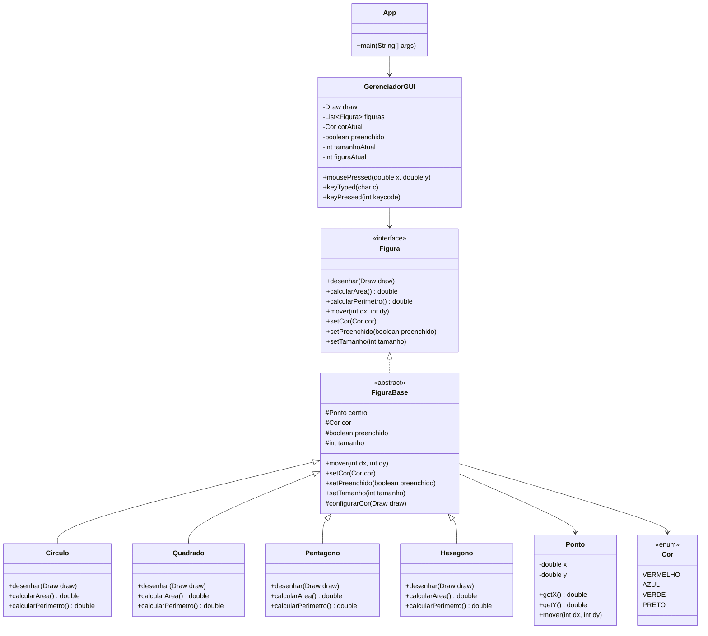
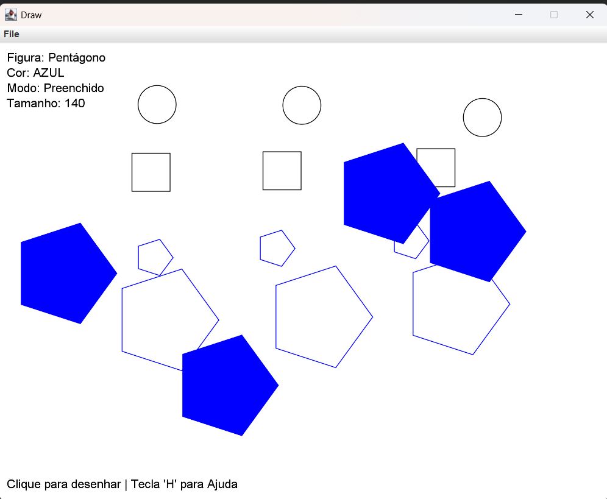

# Lista - 4 POO - Jogo de Desenho Vetorial

Nome: Germano D. Coelho

Um editor gráfico vetorial que permite desenhar diversas formas geométricas utilizando os princípios de Programação Orientada a Objetos.

## Funcionalidades

- Desenho de 4 figuras geométricas:
  - Círculo (F1)
  - Quadrado (F2)
  - Pentágono (F3)
  - Hexágono (F4)
  
- Controles:
  - **Teclas F1-F4**: Selecionar figura
  - **Teclas F5-F8**: Selecionar cor (Vermelho, Azul, Verde, Preto)
  - **Tecla F**: Alternar entre preenchido/vazado
  - **Teclas Q/W**: Diminuir/Aumentar tamanho
  - **Setas**: Mover todas as figuras
  - **Tecla C**: Limpar tela
  - **Tecla P**: Mostrar informações (quantidade, perímetro total, área média)
  - **Tecla H**: Mostrar ajuda

## Diagrama de Classes

abaixo encontra-se uma imagem de demostração da aplicação

